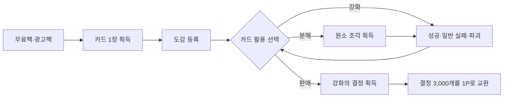

# 카드 대장간 게임 기획서

## 1. 문서 목적

이 문서는 앱인토스용 수집형 카드 강화 게임 **《카드 대장간》**의 제품 방향, 핵심 플레이 순환, 콘텐츠 구조, 경제·보상 운영 원칙, MVP 범위와 기술 경계를 정의한다. 실제 확률과 보상 판정은 반드시 서버에서 수행하며, 출시 전 앱인토스 정책 검토와 수익성 검증을 거친다.

## 2. 제품 개요

- 게임명: **카드 대장간**
- 부제: **6원소 카드 강화게임**
- 핵심 문구: **멈추고 팔 것인가, 파괴를 감수하고 +10에 도전할 것인가!**
- 장르: 수집형 카드 강화·리워드 게임
- 플랫폼: 앱인토스 WebView 미니앱
- 개발 방향: React + TypeScript + Vite 프런트엔드, 서버 권한형 게임 판정
- 핵심 경험: 카드를 얻고, 강화 위험을 판단하고, 판매 또는 보유를 선택하는 짧고 반복 가능한 플레이

## 3. 핵심 플레이 순환

사용자는 강화 단계가 높아질수록 커지는 판매 보상과 파괴 위험 사이에서 선택한다. 포인트 교환 한도에 도달해도 결정은 사라지지 않고 이월되어 장기 목표를 유지한다.

## 4. 카드 구성

### 4.1 원소

| 원소 | 성격 | 시각 콘셉트 |
|---|---|---|
| 땅 | 인내·수호 | 골렘, 숲, 고대 왕국 |
| 물 | 치유·변화 | 해룡, 인어, 얼음 도시 |
| 바람 | 자유·속도 | 정령, 공중도시, 폭풍 기사 |
| 불 | 열정·파괴 | 용, 화염 마녀, 용암 왕국 |
| 빛 | 질서·희망 | 천사, 성기사, 태양 신전 |
| 어둠 | 욕망·금기 | 악마, 그림자 군단, 심연 |

### 4.2 등급

| 등급 | 표현 방향 |
|---|---|
| 노말 | 정적인 기본 카드 |
| 매직 | 원소 빛·입자 효과 |
| 레어 | 홀로그램 프레임 |
| 슈퍼레어 | 부분 반복 애니메이션 |
| 유니크 | 2.5D 움직임과 전용 효과음 |
| 레전더리 | 등장 컷신과 각성 일러스트 |

카드 등급은 수집 가치와 연출에는 영향을 주지만, 동일 강화 단계의 **강화의 결정 판매량에는 영향을 주지 않는다**. 이는 `팩 등급 확률 × 강화 확률`이 포인트 가치에 중첩되는 것을 피하기 위한 원칙이다.

## 5. 카드 획득과 활용

### 획득

- 매일 무료 카드팩 1개
- 보상형 광고 완료 시 일반 카드팩 1개
- 광고팩은 하루 최대 10회
- 광고 재생 실패 시 횟수 차감 없음
- 광고팩 10회 누적 시 레어 이상 보장
- 카드 발행·보유 수량에는 제한을 두지 않음
- MVP 카드 수는 `6원소 × 6등급 = 36장`

카드팩 세부 등급 확률은 운영 데이터와 정책 검토 후 별도 확정한다. 모든 확률은 팩 개봉 전에 이용자에게 공개한다.

### 중복 카드 활용

- 판매: 강화 단계에 해당하는 강화의 결정 획득
- 분해: 같은 원소의 강화 재료 획득
- 강화: 카드의 강화 단계 상승에 사용
- 합성: 동일 등급 카드 5장으로 상위 등급 카드 획득 도전

## 6. 강화 시스템 개요

- 강화 범위: `+0~+10`
- 결과: 성공, 일반 실패, 파괴
- 성공: 1단계 상승
- 일반 실패: 현재 단계 유지
- 파괴: 카드 소멸
- 모든 결과에서 사용한 코인과 재료 소모
- 실패 누적 보정, 천장, 확정 성공 없음
- 파괴돼도 도감 획득 기록과 최고 강화 기록 유지
- 파괴 방지석 사용 시 파괴 결과에서 카드의 현재 단계만 보존하고 재료와 방지석은 소모

정확한 확률표와 판매 보상표는 [GAME_RULES.md](./GAME_RULES.md)를 단일 기준으로 사용한다.

## 7. 재화와 포인트

### 강화의 결정

- 강화 카드를 판매하면 지급
- 보유 한도와 유효기간 없음
- 결정 `3,000개 = 토스 포인트 1P`
- 3,000개 미만 잔액과 한도 초과분은 계속 이월
- 출시 초기 교환 한도: 하루 3P, 월 90P
- 최근 28일 보상형 광고 eCPM과 광고 완료 수를 확인한 뒤 한도 조정

### 기타 게임 재화

- 아르카나 코인: 카드팩 구매 및 강화 비용
- 원소 조각: 해당 원소 카드 강화 및 제작
- 검은 재: 파괴 보상 및 파괴 방지석 제작 후보 재화

게임 재화 간 역할과 포인트 교환 가능 여부를 UI에서 명확하게 구분한다.

## 8. 화면 구성

| 화면 | 핵심 기능 |
|---|---|
| 홈 | 무료팩·광고팩, 보유 결정, 오늘 교환 가능 포인트 |
| 카드 | 보유 카드, 원소·등급·강화 단계 필터, 판매·분해 |
| 대장간 | 카드 선택, 확률·보상 고지, 강화 실행 및 결과 연출 |
| 도감 | 6원소 × 6등급 수집 현황, 최고 강화 기록 |
| 교환소 | 결정 내역, 포인트 교환, 일·월 한도와 잔여량 |

## 9. MVP 범위

- 36장 카드와 임시 일러스트
- 카드팩 획득·개봉
- `+0~+10` 강화 전체 흐름
- 성공·일반 실패·파괴 연출
- 카드 판매와 결정 장부
- 결정 3,000개당 가상 1P 교환
- 일 3P·월 90P 제한
- 36장 도감과 최고 강화 기록
- 테스트 계정과 가짜 광고 완료 처리
- 관리자용 확률·경제 시뮬레이션

실제 토스포인트 지급은 게임 루프와 손익 검증 후 연동한다.

## 10. 기술 구조

### 프런트엔드

- React + TypeScript + Vite
- React Router
- TanStack Query
- Zustand
- Framer Motion
- Vitest 및 Playwright

### 서버

- Node.js 기반 API 서버
- PostgreSQL과 거래 장부
- 서버 난수 기반 팩·강화 판정
- 광고 보상 중복 방지
- 포인트 교환 한도 및 지급 상태 관리
- 요청별 `requestId`를 통한 중복 강화 방지

클라이언트는 결과를 계산하지 않고 서버가 반환한 결과만 표시한다.

## 11. 최소 데이터 모델

| 영역 | 주요 데이터 |
|---|---|
| users | 이용자 식별키, 가입일, 상태 |
| card_templates | 카드명, 원소, 등급, 이미지 |
| user_cards | 소유자, 카드 종류, 강화 단계, 상태 |
| pack_rewards | 광고·팩 보상 기록 |
| enhancement_logs | 강화 전후 단계, 공개 확률, 판정 결과 |
| currency_ledger | 재화 획득·사용 거래 원장 |
| point_exchanges | 결정 차감량, 포인트 지급량과 상태 |
| daily_limits | 날짜별 교환량 |
| collection_progress | 도감과 최고 강화 기록 |

## 12. 운영·보안 원칙

- 강화·판매·포인트 교환은 서버 트랜잭션으로 처리
- 광고 완료는 서버 검증 후 한 번만 지급
- 재화 잔액뿐 아니라 모든 증감을 원장으로 기록
- 다중 계정, 매크로, 비정상 반복 요청 탐지
- 강화 실행 전 성공·일반 실패·파괴 확률과 판매 가치를 표시
- 확률 및 보상 변경 시 버전을 남기고 사전 공지
- 포인트 월렛 예산 부족 시 신규 교환을 안전하게 중단

## 13. 출시 전 필수 검증

1. 앱인토스에 `확률 강화 결과 → 강화의 결정 → 고정 비율 포인트 교환` 구조 사전 문의
2. 강화 시뮬레이션 10만 회 이상 수행
3. 이용자당 광고 완료 수와 보상형 eCPM을 최소 28일 측정
4. 포인트 지급비, 서버비, 세금과 운영비를 포함한 손익 재계산
5. 포인트 1P당 자연스럽게 광고 2회 이상이 발생하는지 확인
6. 확률·보상 고지 및 게임 관련 심사·등급분류 요건 확인

## 14. 성공 지표

- D1·D7 재방문율
- 이용자당 카드팩 개봉 수
- 이용자당 광고 완료 수
- 강화 단계별 도전·중단·판매 비율
- 파괴 후 이탈률
- 포인트 1P당 광고 매출
- 일·월 교환 한도 도달 비율
- 비정상 계정 및 지급 차단 비율

