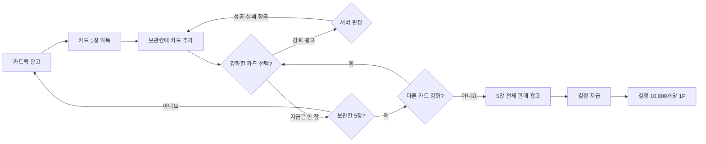

# 카드 대장간 게임 기획서 v2

> 적용 규칙: `card-forge-rules-v2`
> 상세 수치의 단일 기준: [GAME_RULES.md](./GAME_RULES.md)

## 1. 제품 개요

- 게임명: 카드 대장간
- 부제: 6원소 카드 강화게임
- 장르: 광고 기반 수집형 카드 강화·리워드 게임
- 플랫폼: Apps in Toss Granite React Native 미니앱
- 수익 모델: 보상형 광고 전용
- 유료 카드팩, 유료 재화, 캐시 결제: 제공하지 않음
- 핵심 선택: 보관칸의 카드를 언제 강화하고, 5장이 찼을 때 어떤 가치로 판매할 것인가

카드는 1장만 보유한 순간부터 언제든 강화할 수 있고, 5장을 모두 모은 뒤 각 카드를 차례로 강화해도 된다. 강화 순서와 시점은 사용자가 자유롭게 정한다. 카드를 파괴하는 v1의 손실 구조를 제거하며, 강화에 실패한 카드는 현재 단계를 유지하되 추가 강화만 잠기므로 판매 가치는 보존된다.

## 2. 핵심 플레이 순환

## 3. 콘텐츠 구조

- 6원소: 땅, 물, 바람, 불, 빛, 어둠
- 6등급: 노말, 매직, 레어, 슈퍼레어, 유니크, 레전더리
- MVP: 36장
- 강화: 1~10강
- 카드팩: 광고 완료 1회당 카드 1장, 하루 20회
- 보관칸: 최대 5장
- 판매: 보관칸 5장 전체와 판매 광고 1회

카드 등급과 강화 단계는 판매 가치에 모두 영향을 준다. 1강 기본 가치는 노말 10,000결정부터 레전더리 100,000결정까지이며, 현재 강화 단계를 곱한다.

### 3.1 원소 콘셉트

| 원소 | 성격 | 시각 콘셉트 |
|---|---|---|
| 땅 | 인내·수호 | 골렘, 숲, 고대 왕국 |
| 물 | 치유·변화 | 해룡, 인어, 얼음 도시 |
| 바람 | 자유·속도 | 정령, 공중도시, 폭풍 기사 |
| 불 | 열정·파괴 | 용, 화염 마녀, 용암 왕국 |
| 빛 | 질서·희망 | 천사, 성기사, 태양 신전 |
| 어둠 | 욕망·금기 | 악마, 그림자 군단, 심연 |

### 3.2 등급 표현

| 등급 | 표현 방향 |
|---|---|
| 노말 | 정적인 기본 카드 |
| 매직 | 원소 빛·입자 효과 |
| 레어 | 홀로그램 프레임 |
| 슈퍼레어 | 부분 반복 애니메이션 |
| 유니크 | 2.5D 움직임과 전용 효과음 |
| 레전더리 | 등장 컷신과 각성 일러스트 |

## 4. 오늘의 대장간 기후

서버가 맑음·흐림·비·강풍·폭염·황사를 무작위 순서로 섞어 24시간마다 하나씩 적용한다.

- 맑음=빛, 흐림=어둠, 비=물, 강풍=바람, 폭염=불, 황사=땅
- 매일 KST 00:00 변경
- 하루 첫 판매 1회만 적용
- 첫 판매 카드 중 오늘의 원소 카드만 1.5배
- 이후 판매는 모두 1.0배

이 구조는 6원소에 매일 달라지는 보유·판매 전략을 부여하면서 보너스 지급 비용을 하루 한 묶음으로 제한한다.

## 5. 경제와 광고

- 결정 10,000개 = 토스 포인트 1P
- 결정 잔액은 이월하며 게임 자체의 일·월 교환 한도는 없음
- 실제 지급은 토스 프로모션 정책과 예산 한도를 준수
- 카드 5장을 강화하지 않고 판매할 때 최소 광고 6회
- 카드 5장을 성공 또는 실패까지 계속 강화하면 평균 광고 약 29.3회
- 목표 총 eCPM: 5,000원 이상
- 손익 경고 기준: 운영비 공제 전 약 2,550원, 향후 앱인토스 수수료 포함 약 3,000원

실제 수익성은 카드팩 등급 확률을 확정한 뒤 10만 회 이상 시뮬레이션하고, 출시 전 2~4주간 광고 채움률·완료율·eCPM을 측정해 다시 판단한다.

## 6. 화면

| 화면 | 핵심 기능 |
|---|---|
| 홈 | 오늘의 기후, 카드팩 20회, 광고 상태, 보유 결정 |
| 카드 보관함 | 5개 보관칸, 강화할 카드 선택, 카드별 강화·잠금 상태 |
| 대장간 | 강화 확률·실패 잠금·가치 고지, 강화 광고와 결과 |
| 판매 | 보관칸 5장 전체 가치, 첫 판매 원소 보너스, 판매 광고 대기 상태 |
| 도감 | 36장 획득 현황과 최고 강화 기록 |
| 교환소 | 결정 잔액, 교환 내역, 토스 지급 상태 |

## 7. 서버 권한과 데이터

클라이언트는 광고를 요청하고 결과를 표시할 뿐 카드·난수·재화·포인트를 확정하지 않는다.

- 카드팩 횟수와 광고 완료 검증
- 강화 난수와 강화 잠금
- 24시간 기후와 6일 랜덤 주머니
- 하루 첫 판매 보너스 사용 여부
- 카드 5장 일괄 판매와 결정 원장
- 포인트 교환과 지급 상태
- 멱등성, 다계정·매크로·광고 조작 탐지

기존 v1 서버는 단일 카드 판매, 파괴 강화, 3,000결정 환율과 교환 한도를 구현하고 있다. v2 서버 작업에서는 스키마·API·원장 마이그레이션을 먼저 설계하고 기존 데이터를 보존한다.

## 8. 출시 전 필수 조건

1. 카드팩 등급 확률과 천장을 확정·공개한다.
2. 강화와 판매 가치의 경제 시뮬레이션을 10만 회 이상 수행한다.
3. 카드팩·강화·판매 광고의 실제 완료 검증을 연동한다.
4. 앱인토스에 광고 기반 카드 판매와 토스 포인트 지급 구조를 사전 검토받는다.
5. 게임 프로모션 테스트 코드로 지급 흐름을 확인한다.
6. 광고 eCPM, 채움률, 포인트 비용과 프로모션 예산을 운영 대시보드에서 감시한다.
7. 현금 결제와 확률 강화가 결합되지 않도록 유료 기능을 두지 않는다.
8. 확률·광고·포인트 고지와 게임 등급분류 요건을 충족한다.

## 9. MVP 구현 순서

1. v2 DB/API 마이그레이션
2. 카드팩 광고와 하루 20회 제한
3. 강화 광고·확률·실패 잠금
4. 오늘의 기후와 하루 첫 판매 보너스
5. 카드 5장 일괄 판매 광고
6. 결정 10,000개당 포인트 지급
7. 운영 시뮬레이터와 어뷰징 차단

실제 토스 포인트 지급은 게임 루프, 광고 수익성과 프로모션 승인을 모두 검증한 뒤 활성화한다.
